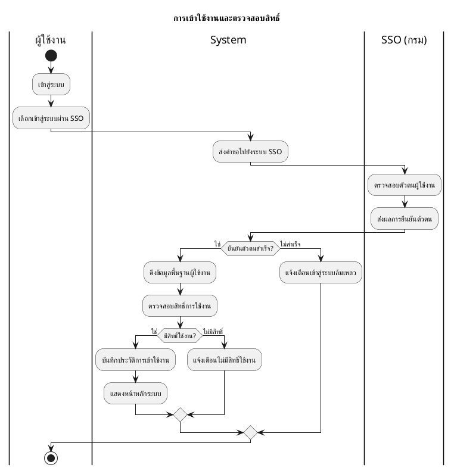
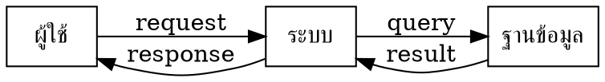

# DevTools — Diagram Tools Requirement

> **สำหรับ Claude Code:** อ่านเอกสารนี้ทั้งหมดก่อนเริ่ม implement
> นี่คือ **add-on module** ต่อจาก DEVTOOLS_REQUIREMENT.md (v1.0)
> เพิ่มหมวด `diagrams` เข้าไปใน project เดิม

---

## 1. Overview

เพิ่ม Diagram Tools เข้าไปในโปรเจกต์ DevTools เดิม รวม 4 tools:

| Tool     | Path                 | วิธี Render                      | Privacy        |
| -------- | -------------------- | -------------------------------- | -------------- |
| Mermaid  | `/diagrams/mermaid`  | Client-side 100% (`mermaid` npm) | 🔒 Local       |
| PlantUML | `/diagrams/plantuml` | Kroki.io API                     | ⚠️ Third-party |
| Graphviz | `/diagrams/graphviz` | WebAssembly (`@hpcc-js/wasm`)    | 🔒 Local       |
| D2       | `/diagrams/d2`       | Kroki.io API                     | ⚠️ Third-party |

---

## 2. Architecture Decision

```
Mermaid   → mermaid npm package     → renders SVG ใน browser โดยตรง
Graphviz  → @hpcc-js/wasm           → Graphviz compiled to WebAssembly
PlantUML  → kroki.io/plantuml/svg/  → encode source → GET → SVG
D2        → kroki.io/d2/svg/        → encode source → GET → SVG
```

**เหตุผลที่ PlantUML / D2 ต้องใช้ Kroki:**
PlantUML ต้องการ Java runtime ทำ browser-only ไม่ได้ Kroki เป็น open-source render service ที่ใช้ได้ฟรี แต่ diagram source จะถูกส่งออกไปนอกเครื่อง ต้องแจ้ง user ชัดเจน

---

## 3. Dependencies ที่ต้องติดตั้งเพิ่ม

```bash
npm install mermaid @hpcc-js/wasm pako
npm install -D @types/pako
```

| Package         | ขนาด   | ใช้ทำอะไร                           |
| --------------- | ------ | ----------------------------------- |
| `mermaid`       | ~2.5MB | Render Mermaid diagrams client-side |
| `@hpcc-js/wasm` | ~3MB   | Render Graphviz/DOT via WebAssembly |
| `pako`          | ~50KB  | Compress source ก่อนส่ง Kroki       |

**สำคัญ:** ทั้ง 3 package เป็น browser-only ต้อง lazy load ทุกตัว:

```ts
// ใช้ dynamic import เสมอ — ห้าม import ที่ top-level
const mermaid = await import("mermaid");
const { Graphviz } = await import("@hpcc-js/wasm");
```

---

## 4. Thai Font Setup

เพิ่ม Google Fonts ใน `app/layout.tsx`:

```html
<link
  href="https://fonts.googleapis.com/css2?family=Sarabun:wght@400;600&display=swap"
  rel="stylesheet"
/>
```

Sarabun ครอบคลุมภาษาไทยได้ดีที่สุดสำหรับ diagram rendering

---

## 5. Registry — เพิ่ม category และ tools

แก้ไขไฟล์ `src/lib/registry.ts`:

```typescript
// เพิ่ม 'diagrams' ใน Category type
export type Category =
  | 'formatters'
  | 'encoders'
  | 'generators'
  | 'converters'
  | 'text'
  | 'network'
  | 'diagrams'   // ← เพิ่มใหม่

// เพิ่มใน CATEGORIES object
diagrams: { label: 'Diagrams', icon: 'GitBranch' },

// เพิ่ม tools เข้า TOOLS array
{ id: 'mermaid',  name: 'Mermaid',  category: 'diagrams', path: '/diagrams/mermaid',  icon: 'Workflow', keywords: ['diagram','flowchart','sequence','uml','chart','mermaid'] },
{ id: 'plantuml', name: 'PlantUML', category: 'diagrams', path: '/diagrams/plantuml', icon: 'Layers',   keywords: ['plantuml','uml','activity','sequence','swimlane','diagram'] },
{ id: 'graphviz', name: 'Graphviz', category: 'diagrams', path: '/diagrams/graphviz', icon: 'Share2',   keywords: ['dot','graphviz','graph','network','digraph'] },
{ id: 'd2',       name: 'D2',       category: 'diagrams', path: '/diagrams/d2',       icon: 'Spline',   keywords: ['d2','diagram','modern','graph'] },
```

---

## 6. Shared Component: DiagramEditor

สร้าง `src/components/diagrams/DiagramEditor.tsx` ให้ทุก tool ใช้ร่วม:

```tsx
interface DiagramEditorProps {
  language: "mermaid" | "plantuml" | "graphviz" | "d2";
  defaultCode?: string;
  examples: { label: string; code: string }[];
  onRender: (code: string) => Promise<string>; // returns SVG string
  privacyNote?: string; // ถ้ามี → แสดง banner ด้านบน
}
```

### Layout ของ DiagramEditor

```
┌─────────────────────────────────────────────────────────────┐
│  [⚠️ Privacy banner — แสดงเฉพาะ PlantUML และ D2]           │
├──────────────────────────┬──────────────────────────────────┤
│  Code Editor             │  Preview                          │
│                          │                                   │
│  textarea (monospace)    │  [rendered SVG]                   │
│  line numbers optional   │                                   │
│                          │                                   │
│                          │                                   │
│                          │                                   │
├──────────────────────────┴──────────────────────────────────┤
│  [▶ Render]  [↓ SVG]  [↓ PNG]  [□ Copy SVG]  Theme: [▼]   │
│                                                              │
│  Examples: [Flowchart ▼]  [Load]                            │
└─────────────────────────────────────────────────────────────┘
```

### Shared Features ทุก tool ต้องมี

- Split pane: editor ซ้าย | preview ขวา
- Auto-render เมื่อหยุดพิมพ์ (debounce แต่ละ tool ต่างกัน)
- Error display ใต้ editor (สีแดง, อ่านได้, ไม่ใช้ alert)
- Export SVG (download file)
- Export PNG (canvas 2x resolution)
- Copy SVG source button
- Example templates dropdown
- Dark mode aware

---

## 7. Export Logic (ใช้ร่วมกันทุก tool)

สร้าง `src/lib/tools/diagram-export.ts`:

```typescript
// Export SVG
export const exportSVG = (svgString: string, filename = "diagram.svg") => {
  const blob = new Blob([svgString], { type: "image/svg+xml" });
  const url = URL.createObjectURL(blob);
  const a = document.createElement("a");
  a.href = url;
  a.download = filename;
  a.click();
  URL.revokeObjectURL(url);
};

// Export PNG (canvas convert — 2x retina)
export const exportPNG = async (
  svgString: string,
  filename = "diagram.png",
) => {
  const svgBlob = new Blob([svgString], { type: "image/svg+xml" });
  const url = URL.createObjectURL(svgBlob);

  const img = new Image();
  img.src = url;
  await new Promise((resolve) => {
    img.onload = resolve;
  });

  const canvas = document.createElement("canvas");
  canvas.width = img.width * 2;
  canvas.height = img.height * 2;
  const ctx = canvas.getContext("2d")!;
  ctx.scale(2, 2);
  ctx.fillStyle = "white";
  ctx.fillRect(0, 0, img.width, img.height);
  ctx.drawImage(img, 0, 0);

  canvas.toBlob((blob) => {
    const a = document.createElement("a");
    a.href = URL.createObjectURL(blob!);
    a.download = filename;
    a.click();
  }, "image/png");

  URL.revokeObjectURL(url);
};
```

---

## 8. Tool D-01: Mermaid Editor

- **Path:** `/diagrams/mermaid`
- **Debounce:** 600ms (render หนักกว่า JSON)
- **Privacy:** 🔒 100% local — ไม่แสดง banner

### Mermaid Init Config

```typescript
import mermaid from "mermaid";

mermaid.initialize({
  startOnLoad: false,
  theme: isDark ? "dark" : "default",
  fontFamily: '"Sarabun", "Noto Sans Thai", sans-serif',
});
```

### Render Function

```typescript
const renderMermaid = async (code: string): Promise<string> => {
  const id = `mermaid-${Date.now()}`;
  const { svg } = await mermaid.render(id, code);
  return svg;
};
```

### Theme Options

`default` | `dark` | `forest` | `neutral` | `base`

### Diagram Types ที่ต้อง support

Flowchart, Sequence, Class, ER, Gantt, State, Pie, Journey, Git Graph, Quadrant, Timeline

### Example Templates (include ตัวอย่างภาษาไทย)

```
flowchart TD
    A[เริ่มต้น] --> B{เงื่อนไข}
    B -->|ใช่| C[ดำเนินการ]
    B -->|ไม่| D[สิ้นสุด]
    C --> D
```

```
sequenceDiagram
    participant ผู้ใช้
    participant ระบบ
    participant ฐานข้อมูล
    ผู้ใช้->>ระบบ: ส่งข้อมูลล็อกอิน
    ระบบ->>ฐานข้อมูล: ตรวจสอบรหัสผ่าน
    ฐานข้อมูล-->>ระบบ: ผลการตรวจสอบ
    ระบบ-->>ผู้ใช้: แสดงหน้าหลัก
```

---

## 9. Tool D-02: PlantUML Editor

- **Path:** `/diagrams/plantuml`
- **Rendering:** Kroki.io API
- **Debounce:** 800ms (มี network round-trip)
- **Privacy:** ⚠️ Third-party — **ต้องแสดง banner บังคับ ซ่อนไม่ได้**

### Privacy Banner

```
ℹ️  PlantUML diagrams are rendered by kroki.io
    Your diagram source is sent to their servers.
    Do not include sensitive information.
```

### Kroki Encode + Render

```typescript
import pako from "pako";

const encodeDiagram = (source: string): string => {
  const compressed = pako.deflate(new TextEncoder().encode(source));
  return btoa(String.fromCharCode(...compressed))
    .replace(/\+/g, "-")
    .replace(/\//g, "_");
};

const renderPlantUML = async (code: string): Promise<string> => {
  const processedCode = injectThaiFont(code);
  const encoded = encodeDiagram(processedCode);
  const url = `https://kroki.io/plantuml/svg/${encoded}`;
  const res = await fetch(url);
  if (!res.ok) throw new Error(`Render failed: ${res.statusText}`);
  return await res.text();
};
```

### Auto-inject Thai Font

```typescript
const injectThaiFont = (code: string): string => {
  const hasThaiChars = /[\u0E00-\u0E7F]/.test(code);
  if (!hasThaiChars) return code;
  return code.replace(
    /@startuml([^\n]*)/,
    "@startuml$1\nskinparam defaultFontName Sarabun",
  );
};
```

### Diagram Types ที่ต้อง support

Activity (Swimlane), Sequence, Use Case, Class, Component, State, Deployment, Timing, MindMap, WBS, Gantt, Network (nwdiag)

### Example Templates (include ตัวอย่างภาษาไทย)

Activity Swimlane (ตัวอย่างหลัก):



### Error Handling

- Network timeout / Kroki unreachable → "Cannot connect to render service. Check your internet connection."
- HTTP 400 (syntax error) → แสดง error message จาก Kroki response
- HTTP 429 (rate limit) → "Too many requests, please wait a moment."

---

## 10. Tool D-03: Graphviz / DOT Editor

- **Path:** `/diagrams/graphviz`
- **Library:** `@hpcc-js/wasm`
- **Debounce:** 500ms
- **Privacy:** 🔒 100% local (WebAssembly)

### Render Function

```typescript
import { Graphviz } from "@hpcc-js/wasm";

let graphvizInstance: Graphviz | null = null;

const renderGraphviz = async (dot: string): Promise<string> => {
  if (!graphvizInstance) {
    graphvizInstance = await Graphviz.load();
  }
  return graphvizInstance.dot(dot); // returns SVG string
};
```

Cache instance ไว้ เพราะ load ครั้งแรกช้า (WASM init)

### Diagram Types ที่ต้อง support

`digraph`, `graph`, `subgraph` (clusters), `strict digraph`

### Example Templates



---

## 11. Tool D-04: D2 Editor

- **Path:** `/diagrams/d2`
- **Rendering:** Kroki.io API (เช่นเดียวกับ PlantUML)
- **Debounce:** 800ms
- **Privacy:** ⚠️ Third-party — **ต้องแสดง banner บังคับ ซ่อนไม่ได้**

### Render Function

```typescript
const renderD2 = async (code: string): Promise<string> => {
  const encoded = encodeDiagram(code); // ใช้ฟังก์ชันเดิมจาก PlantUML
  const url = `https://kroki.io/d2/svg/${encoded}`;
  const res = await fetch(url);
  if (!res.ok) throw new Error(`Render failed: ${res.statusText}`);
  return await res.text();
};
```

### Example Templates

```d2
ผู้ใช้ -> ระบบ: ล็อกอิน
ระบบ -> ฐานข้อมูล: ตรวจสอบ
ฐานข้อมูล -> ระบบ: ผลลัพธ์
ระบบ -> ผู้ใช้: JWT token
```

```d2
direction: right

Frontend: {
  shape: rectangle
}
Backend API: {
  shape: rectangle
}
Database: {
  shape: cylinder
}

Frontend -> Backend API: HTTP
Backend API -> Database: SQL
```

---

## 12. Routing ที่ต้องเพิ่ม

```
/diagrams/mermaid    → Mermaid Editor
/diagrams/plantuml   → PlantUML Editor
/diagrams/graphviz   → Graphviz / DOT Editor
/diagrams/d2         → D2 Editor
```

สร้างไฟล์:

```
src/app/diagrams/mermaid/page.tsx
src/app/diagrams/plantuml/page.tsx
src/app/diagrams/graphviz/page.tsx
src/app/diagrams/d2/page.tsx
src/components/diagrams/DiagramEditor.tsx
src/lib/tools/diagram-export.ts
src/lib/tools/kroki.ts        ← encode + fetch logic ใช้ร่วมกัน
```

---

## 13. Implementation Order

```
1. src/lib/tools/diagram-export.ts    ← export SVG/PNG functions
2. src/lib/tools/kroki.ts             ← Kroki encode + fetch
3. src/components/diagrams/DiagramEditor.tsx   ← shared component
4. /diagrams/mermaid   ← ทำก่อน เพราะ pure client-side
5. /diagrams/graphviz  ← WASM, ไม่มี network
6. /diagrams/plantuml  ← Kroki integration
7. /diagrams/d2        ← ใช้ Kroki เหมือนกัน ต่อได้เลย
8. เพิ่ม registry + sidebar navigation
```

---

## 14. QA Checklist

- [ ] Mermaid render flowchart ภาษาไทยได้ (ตัวอักษรไม่ขาด)
- [ ] Mermaid render sequence diagram ภาษาไทยได้
- [ ] PlantUML activity swimlane ภาษาไทยได้
- [ ] PlantUML auto-inject font เมื่อ detect ตัวอักษรไทย
- [ ] Privacy banner แสดงทุกครั้งใน PlantUML และ D2 ซ่อนไม่ได้
- [ ] Export SVG เปิดใน browser / Figma ได้
- [ ] Export PNG 2x resolution (ไม่แตก retina)
- [ ] Graphviz ทำงาน offline ได้
- [ ] WASM instance ถูก cache (ไม่ reload ทุกครั้งที่ render)
- [ ] Dark mode ปรับ Mermaid theme ตาม app ได้
- [ ] Error แสดงเมื่อ Kroki offline (ไม่ crash)
- [ ] Lazy load ไม่กระทบ performance หน้าอื่น

---

_Document version: 1.0 — Diagram Tools Add-on_
_ใช้คู่กับ DEVTOOLS_REQUIREMENT.md v1.0_
